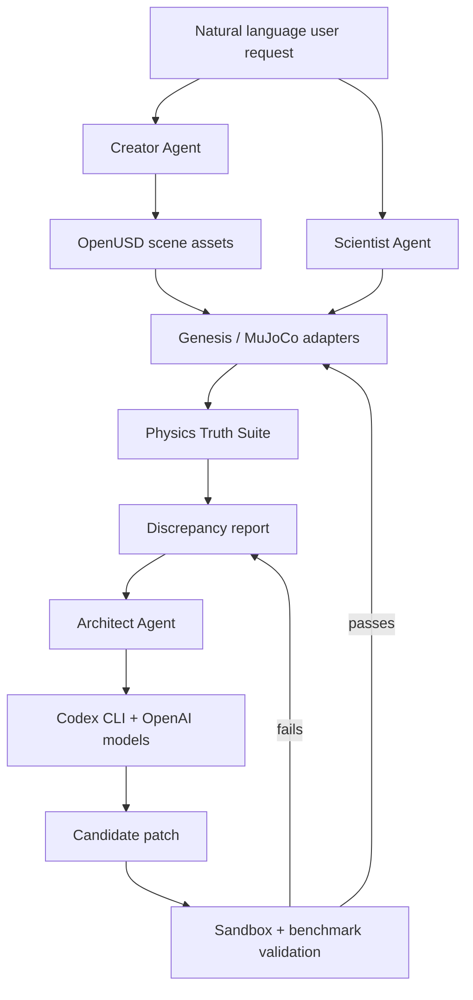

# Reality Kernel Architecture

Reality Kernel is structured as a benchmark-driven agentic simulation system. The project is intentionally modular so that physics engines, scientific data sources, and LLM coding agents can be swapped or extended without changing the core evaluation loop.

## System Layers

## Creator Agent

The Creator Agent transforms natural language object requests into structured simulation assets:

- Geometry and scale.
- Mass and inertia.
- Material properties.
- OpenUSD-compatible scene descriptions.
- Engine-specific adapter parameters.

Scientific material data should be sourced from open or documented references such as PubChem, Materials Project, and NIST where permitted by their terms.

## Scientist Agent

The Scientist Agent turns a question into an experiment plan:

- Hypothesis.
- Scene setup.
- Variables and controls.
- Measurements.
- Expected physical law or empirical reference.
- Tolerance.

It produces structured experiment runs and stores results in a machine-readable format.

## Architect Agent

The Architect Agent is the self-correction loop.

Inputs:

- A failing benchmark result.
- The expected ground-truth behavior.
- Relevant source files.
- Test and CI constraints.

Outputs:

- A narrow code patch.
- A validation report.
- A proposed commit or pull request if the patch passes.

The Architect Agent should never merge a patch without benchmark evidence. Its job is not to make output look plausible; its job is to make the simulation more correct under test.

## Benchmark Contract

Every Physics Truth Suite case should eventually provide:

- Stable experiment ID.
- Category.
- Physical law or empirical baseline.
- Units.
- Input parameters.
- Expected output or tolerance.
- Citation/provenance.
- Executable validation function.

## Initial Implementation Milestones

1. Formalize the benchmark schema.
2. Implement the first mechanics tests.
3. Add a minimal simulation adapter interface.
4. Produce discrepancy reports from benchmark failures.
5. Connect Codex CLI to the patch loop.
6. Publish validation reports for every accepted patch.
